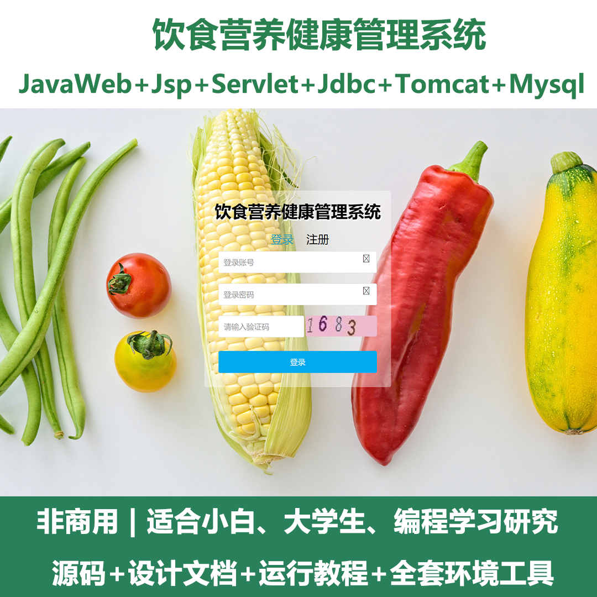
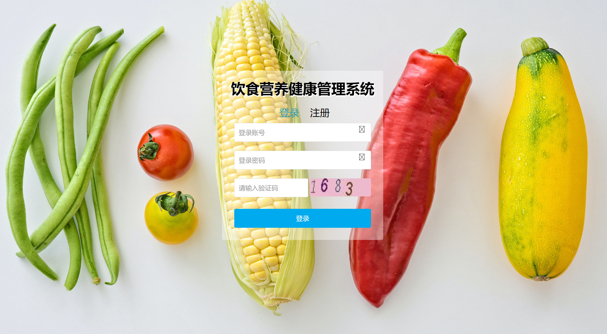
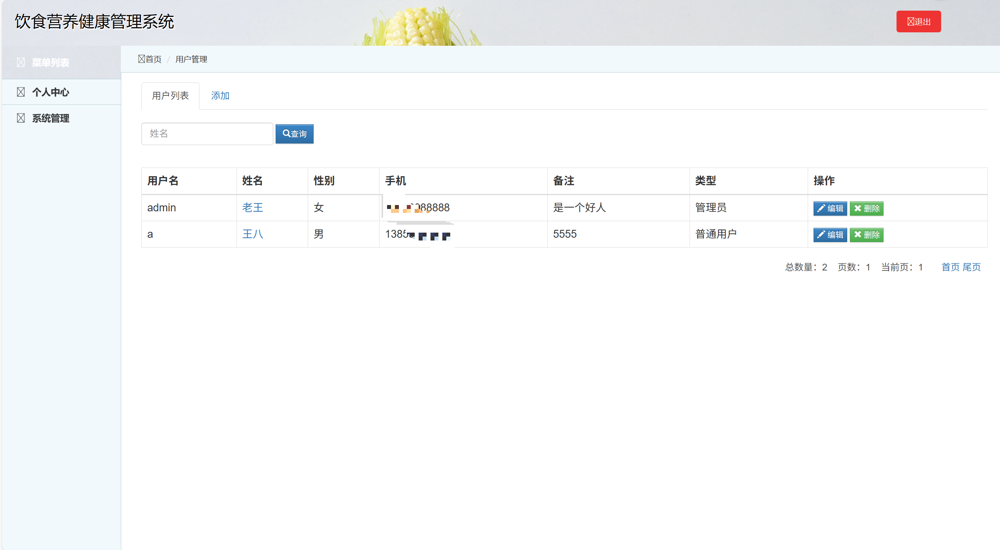
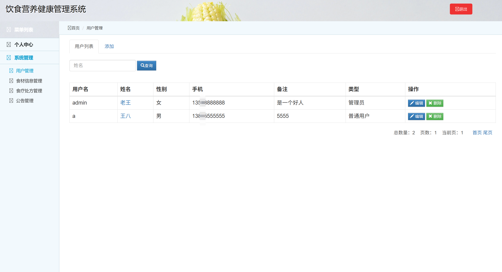
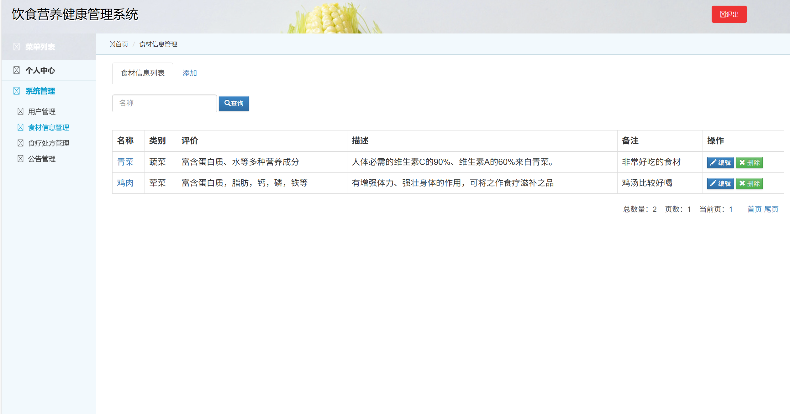
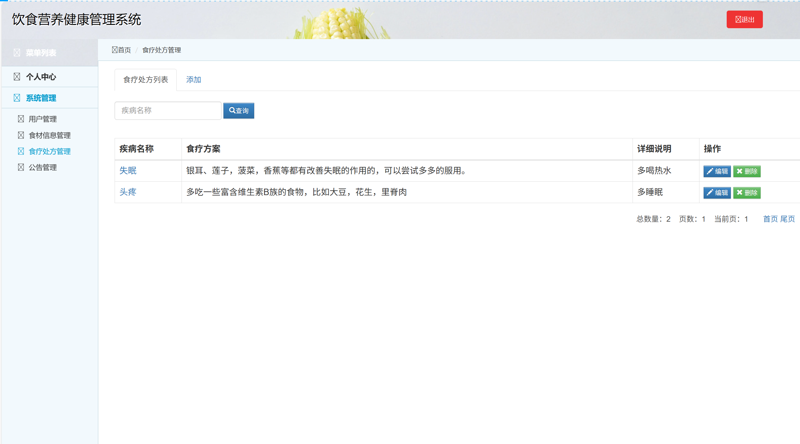
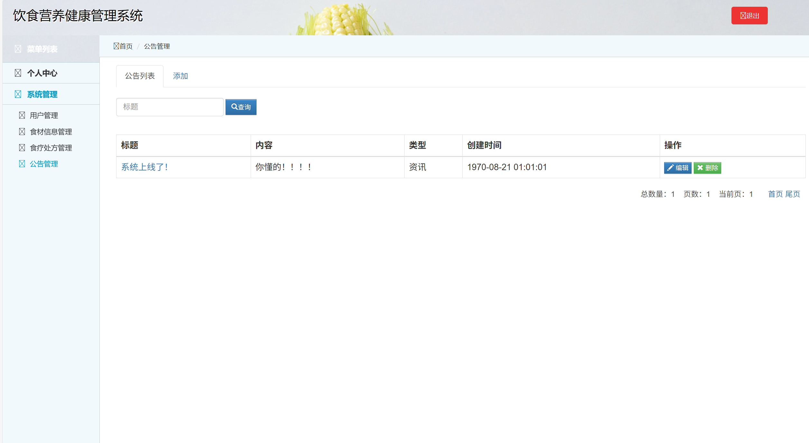
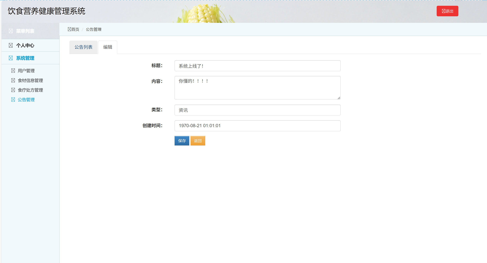
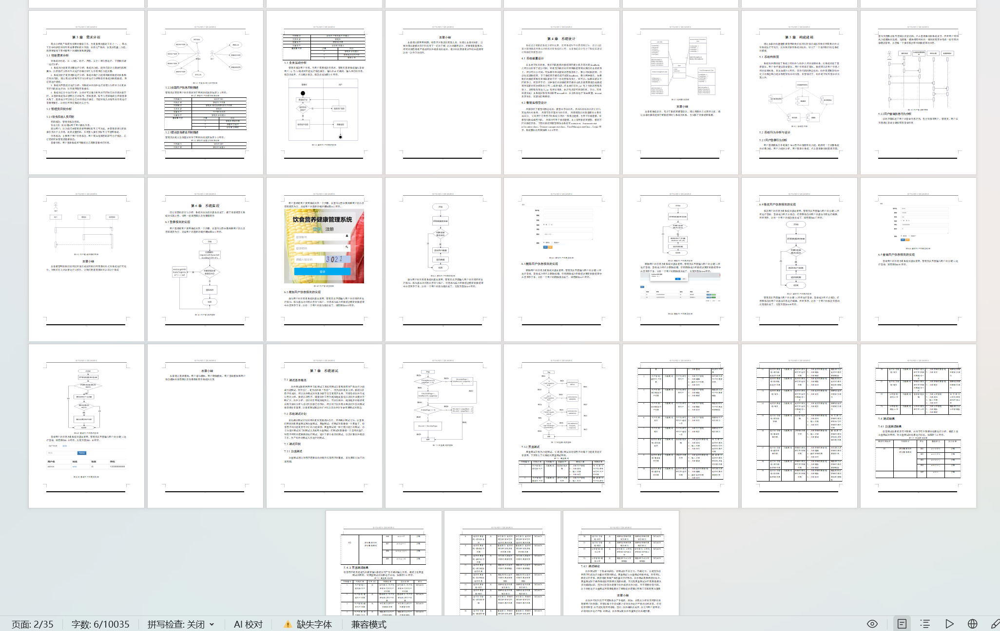

# jspServlet034
jspServlet034饮食营养健康管理系统+BG
 
## 源码问题查看主页咨询

### 一、关键词

饮食营养健康管理系统，健康管理系统、健康饮食习惯系统 

### 二、作品包含
源码+数据库+设计文档+全套环境和工具资源+本地部署教程

### 三、项目技术
前端技术：Html、Css、Js、Jquery、Bootstrap
后端技术：Java、JSP、Servlet、JDBC

### 四、运行环境（以下版本亲测，其他版本兼容性请自行测试）
开发工具：IDEA/eclipse

数据库：MySQL5.7或8.0

服务器：Tomcat8.5或Tomcat9.0

数据库管理工具：Navicat10以上版本

环境配置软件： JDK1.8

浏览器：谷歌浏览器

### 五、项目介绍
项目编号：jspServlet034

话说民以食为天，而健康则是身体的最大本钱。大学时代是学知识长身体的重要阶段，同时也是良好饮食习惯形成的重要时期。作为当代大学生，我们必须掌握一定的营养知识，形成良好的饮食习惯，对于促进生长发育保证身体健康有重要的意义，尤其对于当代大学生，时代赋予我们的使命要我们必须有健康的体魄，具备热血青年的朝气蓬勃，才能成为国家栋梁，那么，关注自我，关注健康就成为我们不可忽视的问题。健康饮食有助于预防所有类型的营养不良以及包括诸如糖尿病、心脏病、中风和癌症在内的非传染性疾病。不健康的饮食和缺乏体育活动是全球主要的健康风险。

饮食营养健康管理系统具备个人中心（可进行个人相关操作）、系统管理（涵盖用户管理，能添加、查询、编辑、删除用户；食材信息管理，用于管理食材相关数据；食疗处方管理，对食疗处方进行管理；公告管理，发布和管理公告等）等功能，可满足饮食营养健康管理方面的用户、食材、食疗处方、公告等多维度管理需求。

### 六、运行截图

